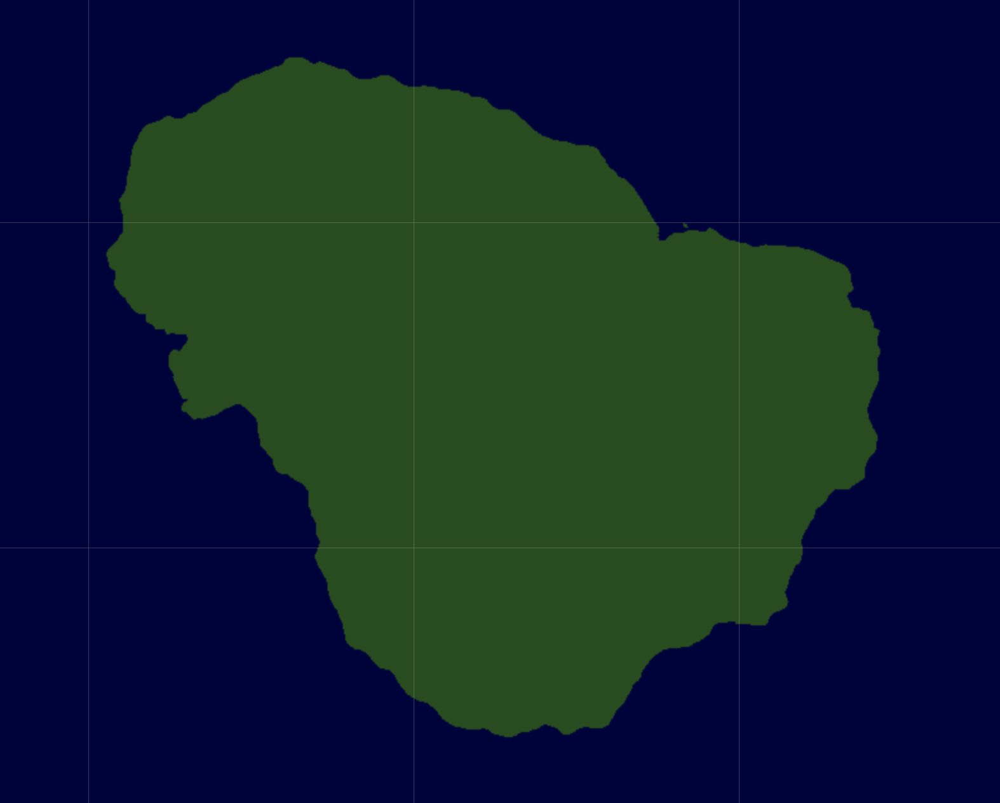

# Leaflet terrain

Using [Vladimir Agafonkin](https://github.com/mourner)'s excellent [Leaflet](https://leafletjs.com) to navigate noise-generated terrain. Code based on [this example](http://www.entropicparticles.com/leaflet/), but heavily modified for performance boost.

This is intended to be a very simple terrain generation. The focus is on learning to use Leaflet rather than generating detail-rich terrains.

See [live demo](https://luciopaiva.com/leaflet-terrain).
